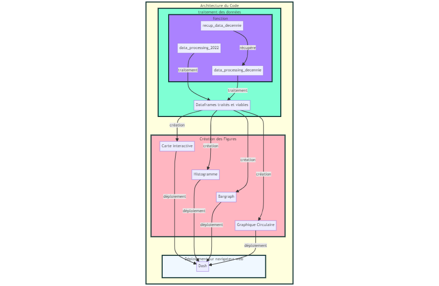

# ReadMe (Anne-Sophia Lim et Yanis Perrin)

## Présentation du projet
Notre projet pour l'unité *Python pour la DataScience* porte sur la thématique du coût de la vie à travers les différents pays du monde.
Avec l'augmentation récentes des prix, l'apparition du Covid-19 en 2020 et la guerre en Ukraine, le coût de la vie semble être au plus haut. 
Mais est-ce vraiment le cas ? 
Etait-il si bas il y a quelques années ?
Qu'en est-il de la France ? Et des autres pays à travers le monde ?
De nombreuses questions que nous tenterons de répondre à l'aide de ce projet.

Notre étude porte sur le coût de la vie moyen sur les **12** dernières années à travers plus de **200** pays et **970** observations. 

> Nous utiliserons 2 manières différentes d'exploiter le coût de la vie :
>
> - A l'aide du coût moyen de la vie par mois calculé en dollar.

> - A l'aide de l'indice du coût de la vie.
>
> Ces 2 paramètres sont calculés à partir d'algorithmes qui utilisent différentes données recueillies pour chaque pays du monde(loyer, salaire moyen, prix des courses, pouvoir d'achat...).

> Pour plus de précision à propos des données :

> - [Livingcost](https://livingcost.org/about "Details sur les données de livingcost.org"). 

> - [Numbeo](https://www.numbeo.com/cost-of-living/cpi_explained.jsp "Details sur les données de Numbeo"). 

Ce 'README' est composé de trois principales parties :

1. **User Guide**(Ce guide indique comment déployer et utiliser notre dashboard)

    1. Cloner le projet.

    2. Obtenir les packages.

    3. Déployer le projet.

2. **Developper Guide** (Ce guide permet de comprendre l’architecture du code et de modifier ou d’étendre celui ci)

    1. Architecture du code.

    - Traitement des données

    - Création des figures

    - Dash

3. **Rapport d'analyse** (Ce rapport met en avant les principales conclusions extraites des données)

    1. Carte interactive
    2. Histogramme
    3. Bargraph
    4. Graphique Circulaire

4. **Conclusion**

A travers ces trois parties, nous présenterons 'l'essentiel' de notre projet, de sa réalisation jusqu'aux observations finales.

*A noter que le dashboard sera en anglais pour raison de simplicité*

## User Guide

### Cloner le projet

Pour pouvoir accéder à notre projet, il faut pouvoir cloner l'original accessible depuis git.

Lancer un terminal (linux) ou gitbash (windows).

Ecrire les instructions suivantes:
> cd Documents

> mkdir projet_perrin_lim

> cd projet_perrin_lim

> git clone https://git.esiee.fr/perriny/dsia-4101a-lim-perrin.git

### Obtenir les packages
Il faut aussi que tous les packages utilisés dans notre projet soit installés sur votre machine.

Dans un terminal écrire l'instruction suivante:
> python -m pip install -r requirements.txt

### Déployer le projet 
Afin de déployer le projet, lancer l'instruction suivante dans le terminal :
> python main.py

Lancer le lien renvoyé après le lancement de la précédente instruction dans un navigateur web.

Celui-ci doit être de la forme suivante : 
> 'http://127.0.0.1:8050/'

Vous pouvez désormais utiliser notre dashboard.

## Developper Guide
### Architecture du code

#### Traitement des données
Notre code possède 3 différentes fonctions :

- recup_data_decennie

- data_processing_decennie

- data_processing_2022

La fonction 'recup_data_decennie' prend en paramètres l'url du site internet dans lequel on scrappe les données et l'année associée aux données scrappés.
Elle nous permet de récupérer les données sur l'indice du coût de la vie sur les 12 dernières années.

Une fois les données récupérées, la fonction 'data_processing_decennie' traite les données récupérés précédemment.
Elle prend en paramètre le tableau des données récupérés à l'aide de 'recup_data_decennie'.

Enfin, la fonction 'data_processing_2022' regroupe les deux fonctions précédentes mais cette fois pour scrapper et traiter les données sur le coût moyen de la vie en dollar par mois en 2022.
Elle prend en paramètres l'url du site internet dans lequel on scrappe les données.

Ces fonctions nous permettent d'obtenir deux dataframes traités et complétement utilisables. 
L'une contient les données sur l'indice du coût de la vie au cours des 12 dernières années à travers 143 pays (773 observations).
L'autre contient les données sur le coût moyen de la vie en dollar par mois en 2022 à travers 197 pays (197 observations).

#### Création des figures
Maintenant que les données sont récupérés et traités, on peut créer les différentes figures qui composeront notre dashboard :

- Une Carte du monde interactive qui permet de visualiser l'indice du coût de la vie à travers les 12 dernières années.

- Un histogramme qui permet de visualiser le nombre de pays par continent pour chaque tranche de coût de la vie par mois en 2022. (Exemple : il y a 20 pays d'Afrique compris entre 400 et 600 $ de coût de vie moyen).

- Deux Bargraph

    - l'un permet la visualisation complète du coût moyen de la vie par mois en 2022 pour chaque pays du monde, mais aussi selon les continents, les pays du G8, la moyenne de chaque continent.

    - l'autre la visualisation des probabilités du coût moyen de la vie par mois en 2022 pour chaque continent. 

    - Un graphique Circulaire qui permet de visualiser la part des continents dans le top 20 des pays ayant le plus important/faible coût moyen de la vie par mois en 2022.

#### Dash
Enfin, on utilise dash pour pouvoir visualiser nos figures dans un navigateur web.
Dash est aussi utiliser pour animer notre carte du monde afin de rajouter un côté interactif à notre carte. 
Une animation est disponible à l'aide du bouton 'play/pause' qui permet de visualiser l'évolution de l'indice du coût de la vie à travers les 12 dernières années.

## Rapport d'analyse
Maintenant que le travail de récupération, traitement et visualisation des données est terminé, nous pouvons analyser ces figures et pouvoir répondre à nos questions.

### Carte interactive
On entend souvent que le coût de la vie n'a jamais été aussi haut ces derniers temps. 
Observons notre carte interactive qui regroupe les données sur l'indice du coût de la vie sur les 12 dernières années.

Prenons l'exemple de la France. 

En 2022, l'indice du coût de la vie en France est estimé à *74.13*. 

Qu'en est-il avant tout les événements récents(covid-19, guerre en ukraine..)?

En 2018, 2 ans avant le covid-19, l'indice était estimé à *83.86*.

Malgré ce que l'on peut penser, celui-ci était donc plus élever avant tous ces événements.

En 2012, 10 ans auparavant il était de *98,19*.

En 2010, il était de *123.49* (l'observation la plus élevé). 

La crise financière de 2008 a sûrement un impact sur ces observations mais on peut constater que l'indice du coût de la vie en France en 2022 n'est pas si élevé en comparaison aux précédentes années !

Les mêmes observations sont observés aux Etats-Unis où la valeur de l'indice baisse constamment depuis 12 ans.

**De manière générale, l'indice du coût de la vie n'est pas aussi élevé que les années précédentes voire plus bas.**

### Histogramme
L'histogramme nous renseigne sur la répartition des pays pour chaque continent en fonction de leur coût moyen de la vie par mois en 2022.
On remarque que la plupart des pays africains et asiatiques sont compris entre *400$* et *1200$* tandis que les pays européens sont répartis équitablement entre *400$* et *1400$* et même présent jusqu'à *3500$*.
Cette histogramme nous renseigne déjà sur la diférrence entre les continents.
En moyenne, les pays asiatiques et africains semblent avoir un coût moyen en 2022 plus faible qu'en Europe ou en Amérique du Nord.
L'Océanie est aussi un continent intéréssant à étudier car on remarque, à l'instar de l'europe, que les pays d'océanie sont équitablement réparties entre *400$* et *2000$*.

Une grande diversité est donc observer.

### BarGraph
1. Bargraph n°1

Ce premier bargraph est très intéressant car il indique le coût moyen de la vie par mois en 2022 pour **chaque pays du monde**.

En 2022, le pays ayant le coût moyen de la vie par mois le plus élevé est **Monaco** avec un coût moyen de *3585$*, ce qui n'est pas étonnant et plutôt logique.

A l'inverse, le pays ayant le coût moyen de la vie par mois le plus faible est le **Pakistan** avec un coût moyen de *294$*, un pays fragilisé par la pauvreté et des inégalités considérables.

Le coût de la vie dans un pays est aussi souvent le reflet de la situation financière du pays et de ses habitants. 

En filtrant le bargraph aux pays européens uniquement, on observe que le coût moyen de la vie par mois en 2022 en **France** est estimé à 1363$. Une valeur proche du salaire minimale autorisé.

Enfin, si on filtre le bargraph par la moyenne du coût de la vie par mois en 2022 des continents, on observe que le continent avec la moyenne la plus élevé est l'**Europe** avec une moyenne de 1201$ suivi de près par l'**Amérique du Nord** avec une moyenne de *1147$*. L'**Afrique** est le continent qui a un coût moyen de la vie par mois en 2022 le plus faible avec une moyenne de *688$*.

2. Bargraph n°2

Ce deuxième bargraph nous informe de la probabilité du coût de la vie moyen pour chaque continent en 2022. 

**50%** des pays d'amérique du sud ont un coût moyen entre 600$ et 800$.

En Europe comme en Océanie cette probabilité est équiprobables.

- Entre 400$ et 1400$ pour l'Europe.

- Entre 400$ et 2000$ pour l'Océanie.

Ces données sont bien évidemment en concordance avec les données sur le nombre de pays par tranche de coût moyen en 2022(histogramme précédent) mais permettent une meilleure visualisation dans la globalité.

### Graphique Circulaire

Le graphique circulaire nous permet d'observer la part des continents dans le top 20 des pays ayant le plus important/faible coût moyen de la vie par mois en 2022.

Sans surprise, **50%** des 20 premiers pays sont européens tandis que seulement **10%** dans les 20 derniers. 

**Aucun** pays d'Afrique n'est dans les 20 pays ayant le plus important coût moyen, **25%** sont présent dans les 20 pays ayant le plus faible coût moyen.

L'Asie est le continent avec le pourcentage de pays le plus élevé dans le top 20 des pays ayant le plus faible coût moyen avec un pourcentage de **60%**.

## Conclusion

L'indice du coût de la vie en France reste l'un des plus élevés dans le monde en 2022 mais contrairement à ce que l'on peut penser il est encore loin de celui enregistré en 2010 ou en 2012.

L'impact de la guerre ou du covid-19 reste amoindri. 
Le coût de la vie est aussi une représentation de la situation financière et sociales du pays.